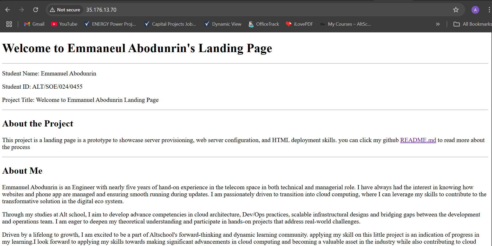

# Creating a prototype for a web application project

This repository contains the steps and resources for deploying a prototype web application, which includes provisioning a Linux server, setting up a web server, and deploying a simple HTML landing page.

## Project Overview
This project demonstrates the ability to provision a server, configure a web server, and deploy a simple HTML page showcasing our team's capabilities to potential investors.

---

## Landing Page
- **Name**: Emmaneul Abodunrin
- **Project Title**: Welcome to Emmaneul Abodunrin's Landing Page
- **Description**: A prototype web application to demonstrate server provisioning, web server configuration, and HTML deployment.
- **Bio**: Emmanuel Abodunrin is an Engineer with nearly five years of hand-on
        experience in the telecom space in both technical and managerial role. I
        have always had the interest in knowing how websites and phone app are
        managed...

---

## Deliverables
- **Public IP Address**: 35.176.13.70

  

---

## Deployment Steps

### 1. Provisioning the Server
1. **Platform**: AWS (Amazon Web Services)
2. **Instance Type**: t2.micro (Free Tier Eligible)
3. **Linux Distribution**: Ubuntu 22.04 LTS
4. **Steps**:
   - Log in to your AWS Management Console.
   - Launch an EC2 instance with Ubuntu 22.04 LTS.
   - Select a key pair for secure SSH access or create a new one.
   - Assign a security group allowing SSH (port 22) and HTTP (port 80) access.

---

### 2. Configuring the Server
1. **Update the Package Index**:
   ```bash
   sudo apt update
2. **Install Apache Web Server**:
   ```bash
   sudo apt install apache2 -y
   sudo systemctl status apache
3. **Enable Apache Service**:
   ```bash
   sudo systemctl enable apache2
   sudo systemctl start apache2
4. **Verify the Deployment**:
Open a web browser and navigate to public IP address below:

      http://35.176.13.70
---

## 3. HTML Page Deployment 
1. **Create the HTML Page**:
   - write an html code with a text editor e.g Virtual Studio Code (VS Code).
   - safe locally as index.html
   - Add the following content
   - Save and close the file.
      ```html
         <!DOCTYPE html>
         <html lang="en">
        <head>
          <meta charset="UTF-8" />
          <meta name="viewport" content="width=device-width, initial-scale=1.0" />
          <title>AltschoolPro1</title>
        </head>

        <body>
          <header>
            <h1>Welcome to Emmaneul Abodunrin's Landing Page</h1>
          </header>
            <hr>
          <div>
         <p>Student Name: Emmanuel Abodunrin</p>
         <p>Student ID: ALT/SOE/024/0455</p>
         <p>Project Title: Welcome to Emmanuel Abodunrin Landing Page</p>
          </div>
          <hr />
          <section>
          <h2>About the Project</h2>
         <p>
           about the project text
         </p>
         <hr />
         <h2>About Me</h2>
         <p>
           About me text
         </p>
          </section>
          <hr />
          <footer>
            &copy; 2024 Emmaneul Abodunrin. All rights reserved.
          </footer>
         </body>
      </html>

2. **Git push to repository**:
   - Create a repository, in this case github was used.
   - below are the relivant conmmand to push html file to remote repository
      ```bash git init
      git init
      git status
      git add index.html
      git commit -m "commit index.html for the first time"
      git remote add origin https://github.com/emmatunde/Altschoolpro1
      git romote -v
      git pull https://github.com/emmatunde/Altschoolpro1
      git push -f origin main       
3. **Navigate to the web server directory**:
      
         cd /var/www/html
- clone git repository to your web server

        git clone https://github.com/emmatunde/Altschoolpro1
        sudo mv Altschoolpro1/* .

- Open a web browser (e.g chrome) and navigate to public IP address below:

      http://35.176.13.70

---

## 4. Networking Configuration
Allow HTTP Traffic:
In your AWS Security Group, add a rule to allow HTTP traffic on port 80.
   `sudo ufw allow 80`
Verify Connectivity:
Test the connection by accessing your public IP address.
   `sudo ufw status`
   
---

## 5. Enabling HTTPS
1. **Install Certbot**:

         sudo apt install certbot python3-certbot-apache -y
2. **Obtain a Free SSL Certificate**:

         sudo certbot --apache
3. **Renew Certificate Automatically**:

         sudo crontab -e

5. **Add the following line**:
   
         0 0,12 * * * certbot renew --quiet

---

Additional Information
Git Repository: https://github.com/emmatunde/Altschoolpro1
Tools Used: AWS, Ubuntu, Apache, HTML, Certbot (for HTTPS)
Author: Emmaneul Abodunrin
